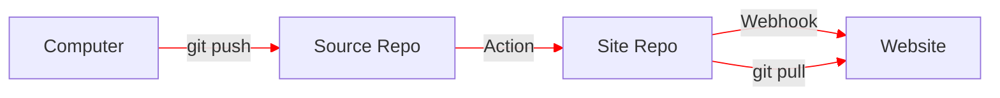

+++
date = '2024-11-27T08:26:51Z'
draft = false
title = 'Publishing'
description = 'Getting the posts from the computer to the website'
tags = ["blog", "github actions"]
+++

I'm using [Github Actions](https://github.com/features/actions) to build and publish this site. In this setup I'm using two repositories, One for the source and another for the built site. On a push to the source repository an action runs which:

* Installs Hugo on the GitHub runner
* Checks out the source repository
* Checks out the built site repository
* Runs Hugo to build the site, redirecting output to the built site directory
* Creates a commit in the built site repository and pushes it

In the built site repository, on a push, another action calls a webhook. This is a script (defined within the built site repository) which simply does a `git pull`. This avoids having to do push the site from actions via SCP or some other mechanism.

TODO: Fix styling of [mermaid.js diagrams](https://gohugo.io/content-management/diagrams/#mermaid-diagrams) - particularly arrowhead colours in the dark theme version of the site. 
